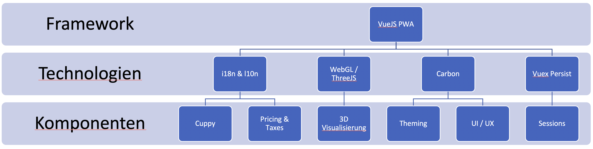
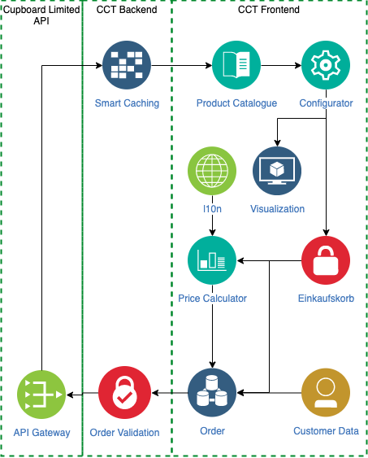
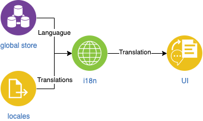
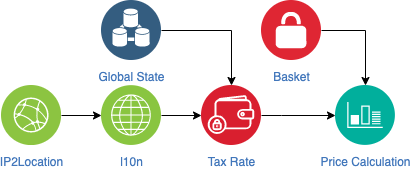
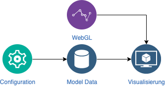
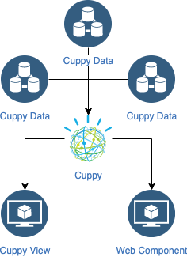

# Cupboard Configuration Tool (CCT)

[](https://travis-ci.org/relativityhd/CCT)

New online shop and configuration tool made for Cupboard Limited, a simulated software development project at the DHBW Stuttgart. Currently on MVP status.

## Installation steps

### Prerequisites

- NodeJS v12
- npm v6

### Easy Setup

``` bash
npm install
npm build
npm start
```

## Documentation



Das Produkt besteht aus zwei Teilen, dem Backend und dem Frontend. Das Backend dient als Mittelsmann für API und Frontend, hier werden Bestellungen geprüft und die Daten aus der API gesammelt und strukturiert an das Frontend weitergegeben. Für das Backend wurde das NodeJS-Framework Express genutzt.

Das Frontend realisiert die Darstellung des Produkts und den Konfigurator darin wird auch die 3D Visualiserung erstellt und berechnet. Zudem werden Steuer und Sprachlokalisierungen realisiert. Das Frontend ist im Framework VueJS entwickelt, wobei verschiedene Hilfstechnologien zum Einsatz kommen. Vue gibt außerdem Gute Praxis für die Software Architektur vor. Für die Lokalisierung der Sprache wird Vue i18n genutzt, wodurch Übersetzungsdateien einfach zu erstellen sind. Alle Komponenten in der App sind Carbon Komponenten, welche ein einheitliches Design bieten. Die 3D Visualisierungen sind in der WebGL-Bibliothek threeJS erstellt und werden in Vue Komponenten eingebunden.

### Dataflow



### i18n



Mit der i18n Bibliothek werden sämtliche Ausgaben nicht mehr in den Komponenten geschrieben sondern in seperaten Sprachdateien. Für jede Komponente gibt es eine eigene Datei in jeder Sprache. Entsprechend der Spracheinstellungen werden von i18n die passenden Sprachdateien ausgewählt und gerendert.

### Preisberechnung



Mit der ausgewählten bzw. geschätzten Lokation des Nutzers wird ein Steuersatz gewählt anhand von diesem werden die Preise berechnet. Ändert der Nutzer seien Ort ändern sich auch die Steuersätze.

### Visualisierung



Die Visualisierung geschieht in threeJS. In ThreeJS werden die Elemente in Meshs aus Geometrien und Materialien definiert. Aus den vorgegebenen Maßen werden die Visualisierungen berechnet. Die Visualisierung mit jeder neuen Dateneingabe neuberechnet.

### Cuppy



Cuppy ist der persönliche Assistant auf der Cupboard Ltd. Seite. Cuppy ist eine einzelne Vue Komponente, die mit der Website über von den Tools implementierte Methoden interagiert. Sämtliche Business Logic von Cuppy wird in Cuppy selbst ausgeführt. So ist Cuppy leicht in neue Features zu implementieren und neue Features für Cuppy lassen sich schnell einfügen.
Cuppy passt sich je nach aktueller Seite an und bietet verschiedene Hilfsfeatures für Nutzer, die sich beliebig erweitern lassen.
